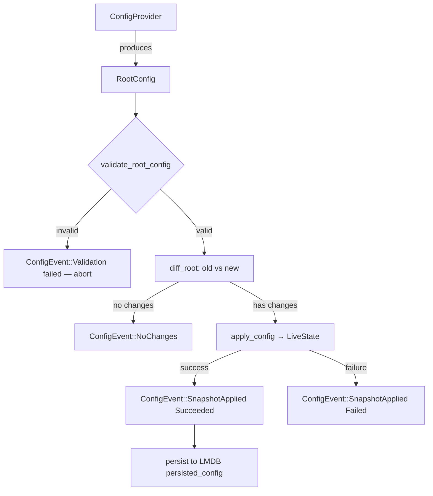

VES is a multi-component platform where independent Rust binaries communicate through shared, Protobuf-defined data contracts. Understanding how data moves from a log file on disk through to the HEIMDELL Server gives you the mental model needed to configure, operate, and extend the platform.

## Components

VES is composed of three workspace members defined in the root `Cargo.toml`:

**`core-agent`** is the host-level binary you deploy on every machine you want to observe. It collects raw data from configured source drivers (filesystem, journald, and socket), runs that data through a processor pipeline to produce enriched events, and forwards those events to the HEIMDELL Server over gRPC. It maintains an LMDB-backed recovery layer so collection resumes exactly where it left off after a crash or restart — no data loss, no duplicate reads.

**`heimdell`** is the server-side component that receives enriched events from one or more Core Agents. It is under active development.

**`ves_lib`** is a shared Rust library — not a running binary. It is the backbone of inter-component communication: it contains all Rust structs generated from `.proto` files via `buf generate`, and common utilities used by both `core-agent` and `heimdell`. Because both binaries depend on `ves_lib`, data contract changes are made in one place and enforced across the platform by the Rust compiler.

```
VES workspace
├── components/core-agent    ← host binary: collect → process → forward
├── components/heimdell      ← server binary: receive → store → serve
└── components/ves_lib       ← shared library: data contracts + utilities
```

---

## Data flow

The path a log line takes from disk to the HEIMDELL Server passes through five stages:


### 1. Source drivers

A source driver is a long-running Tokio task that watches an external data source and emits `SourcePayload` values onto an async channel. Three driver types are implemented:

**Filesystem driver** — built from two cooperating components:

- The **Watcher** uses the [`notify`](https://crates.io/crates/notify) crate to receive OS-level filesystem events for each configured directory. On startup it performs an initial scan with `discover_initial_files`, then polls every five seconds with `discover_new_files` to catch files created between events. For each file it tracks a `FileState` (path, inode, byte offset) inside a `Checkpoint` map keyed by inode. When a file is rotated it removes the old inode from `Checkpoint` and inserts the new one atomically, emitting a `WatcherEvent::FileRotated` downstream.
- The **Tailer** is spawned per inode. It opens the file at the recorded offset and streams chunks through an async reader, constructing a `TailerPayload` for each chunk and sending it downstream. A `CancellationToken` lets the `TailerManager` stop individual tailers cleanly when a file is removed or a source driver is disabled by a config change.

**Journald driver** — reads from the systemd journal, filtering by configured `units` and starting from an optional `since` cursor. Each entry becomes a `SourcePayload` with a `SourceOrigin::Journald` variant carrying the unit name and journal cursor position.

**Socket driver** — binds a TCP, UDP, or Unix socket and accepts incoming data. Each received datagram or stream chunk becomes a `SourcePayload` with a `SourceOrigin::Socket` variant carrying the peer address and protocol.

### 2. SourcePayload

Every source driver emits the same type regardless of origin:

```rust
pub struct SourcePayload {
    pub raw_data: Bytes,
    pub origin:   SourceOrigin,
    pub size:     usize,
}

pub enum SourceOrigin {
    File    { path: PathBuf, inode: u64, offset: u64 },
    Journald { unit: String, cursor: String },
    Socket  { peer_addr: SocketAddr, protocol: Protocol },
}
```

The `origin` field preserves enough context for the processor pipeline to enrich the event with metadata — for example, which file it came from, which systemd unit produced it, or which remote peer sent it.

### 3. Processor pipeline

The processor pipeline consumes `SourcePayload` values and produces `EnrichedEvent` structs defined in `ves_lib`. The pipeline version is tracked as a `u64` in `ProcessorState` and is bumped each time the config system applies a new processor configuration.

<Note>
  The processor pipeline internals are under active development. The config schema for `[processor]` is defined but the pipeline execution engine is not yet implemented.
</Note>

### 4. Transport: gRPC / Protobuf

`EnrichedEvent` and other shared message types are defined as `.proto` schemas in the `/proto` directory and compiled into Rust structs by `buf generate`. These structs live in `ves_lib/codegen`. Both `core-agent` and `heimdell` use these types directly — neither binary duplicates message definitions.

The current transport is [Tonic](https://crates.io/crates/tonic) (gRPC over HTTP/2). `ves_lib` itself is transport-agnostic; gRPC implementation code lives only inside the component binaries. This design allows the transport layer to be replaced without touching data contracts or application logic.

---

## Config lifecycle

The Core Agent's configuration system is built around the concept of a desired state: every supported config provider produces a `RootConfig` snapshot, and the `ConfigManager` is responsible for validating, diffing, applying, and persisting that snapshot.



### ConfigProvider

Three providers can supply a `RootConfig` to the `ConfigManager`:

```rust
pub enum ConfigProvider {
    StaticFile,               // reads a local TOML file at startup
    HEIMDELLServerRemoteAPI,  // polls config from a connected HEIMDELL Server
    LocalRemoteAPI,           // served from a local HTTP API
}
```

The `StaticFile` provider is what you use in the quickstart. The remote providers enable centralised config management from the HEIMDELL Server.

### RootConfig

`RootConfig` is the top-level configuration snapshot. Every provider must produce a value conforming to this struct:

```rust
pub struct RootConfig {
    pub agent:     CoreAgentConfig,
    pub sources:   SourcesConfig,
    pub processor: ProcessorConfig,
    pub metadata:  Option<RootConfigMetadata>,
    pub storage:   Option<StorageConfig>,
    pub security:  Option<SecurityConfig>,
}
```

`RootConfig::empty()` produces a known-good zero-value used when computing the initial diff on first startup.

### ConfigManager

`ConfigManager` owns `LiveState` — the runtime's view of what is currently running — and the `last_applied_version` hash. Its `process_config` method drives the full lifecycle on every incoming snapshot:

1. **Version check** — computes a `ConfigVersion` (SHA-256 of the raw config bytes). If the version matches `last_applied_version` the call returns immediately; identical configs are no-ops.
2. **Validation** — `validate_root_config` runs structural and semantic checks: duplicate source IDs, missing TLS material, non-existent paths, permission errors, and cross-component consistency warnings (e.g. authentication without TLS).
3. **Diff** — `diff_root` compares the incoming `RootConfig` against `LiveState.last_applied_config` and produces a `RootConfigDiff` containing a list of `Operation` values (`AddSource`, `RemoveSource`, `UpdateSource`, `EnableStorage`, `UpdateSecurity`, etc.).
4. **Apply** — `apply_config` executes each operation against `LiveState`, updating source driver instances, processor state, storage, and security in place.
5. **Persist** — on success, the raw config bytes are written to the `persisted_config` LMDB database so the agent can recover its last known desired state after a restart.

Every step emits typed `ConfigEvent` values (`NewSnapshot`, `Validation`, `DiffPresent`, `SnapshotApplied`, `PersistedSnapshot`, `PersistFailed`) that the runtime can log, expose as metrics, or forward to the HEIMDELL Server.

### LiveState

`LiveState` is the agent's runtime self-model. It tracks:

- `lifecycle: LifecycleState` — one of `Starting`, `Running`, `ApplyingConfig`, `Stopping`, `Stopped`, `Failed`
- `sources: SourcesState` — a `HashMap<String, SourceInstanceState>` indexed by source driver ID
- `processor: ProcessorState` — current pipeline version and status
- `storage: Option<StorageState>` — LMDB connection health
- `security: Option<SecurityState>` — TLS/auth credential status
- `last_applied_config: Option<RootConfig>` — the config that produced the current state
- `health: HealthStatus` — `Healthy`, `Degraded` (any source driver failed), or `Unhealthy` (lifecycle failed)

Config application is only permitted when `lifecycle == Running`. The `begin_apply` / `finish_apply` / `fail_apply` methods gate this transition and track per-operation progress.

---

## Recovery layer

The recovery layer ensures the Core Agent survives crashes and restarts without losing track of where it was in each log file. It is built on [LMDB](https://crates.io/crates/lmdb) — a memory-mapped key-value store that provides ACID transactions with zero configuration.

On startup, `PersistenceEngine::new_env` opens (or creates) an LMDB environment at the path specified by `storage.data_dir`. Three named databases are opened inside that environment:

| Database | Purpose |
|----------|---------|
| `watcher_db` | Persists `Checkpoint` state — the inode → `FileState` map for each filesystem source driver. Enables the Watcher to resume from the correct file position after a restart. |
| `tailer_db` | Persists per-Tailer byte offsets. On restart, each Tailer seeks to the last committed offset rather than re-reading from the start of the file. |
| `persisted_config` | Stores the last successfully applied `RootConfig` as raw bytes. On startup with a `StaticFile` provider this is overwritten; with remote providers it is used to restore the last known desired state while the remote config is fetched. |

The `PersistenceEngine` is shared across the recovery subsystem via `Arc<Environment>`, and all reads and writes go through typed `TxnReader` / `TxnWriter` helpers that wrap LMDB transactions.

<Warning>
  The LMDB environment is opened with a 1 TiB map size. On Linux this is a virtual address space reservation, not actual disk usage. Ensure `storage.max_disk_bytes` is set to a value appropriate for your host's available disk space.
</Warning>

---

## Component quick reference

<CardGroup cols={2}>
  <Card title="Core Agent overview" icon="microchip" href="/core-agent/overview">
    Full reference for the Core Agent binary, its responsibilities, and operational guarantees.
  </Card>
  <Card title="Configuration" icon="sliders" href="/core-agent/configuration">
    Every TOML field for `[agent]`, `[sources]`, `[storage]`, and `[security]`.
  </Card>
  <Card title="Source drivers" icon="plug" href="/core-agent/sources">
    Configure filesystem, journald, and socket source drivers with examples.
  </Card>
  <Card title="Recovery and storage" icon="database" href="/operations/recovery">
    Operate the LMDB recovery layer: backup, inspect, and troubleshoot checkpoint state.
  </Card>
</CardGroup>
